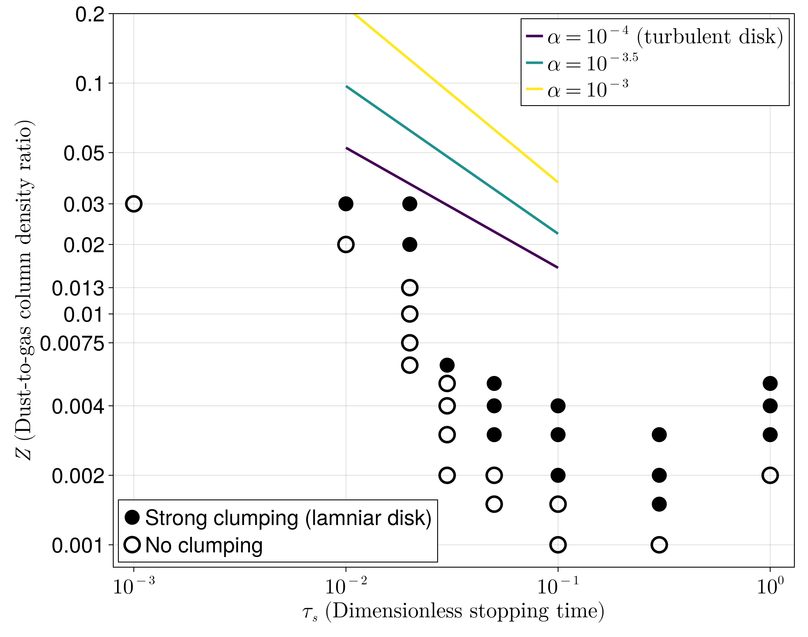

_Dubrovnik, Croatia_

I was born and raised in Seoul, South Korea. My journey into astronomy began in 2012 when I entered Chungnam National University in Daejeon, South Korea, and chose astronomy as my major. I completed both my Bachelor’s and Master’s degrees there before moving to the United States in 2020. I am currently a Ph.D. student in the Department of Physics and Astronomy at Iowa State University, working with Prof. Jake Simon and our research group. Together, we explore the physics of planet formation using advanced numerical simulations.

# Research

## Conditions for Planetesimal Formation by the Streaming Instability in Protoplanetary Disks

     
My primary research focuses on planetesimal formation within protoplanetary disks. Planetesimals, roughly 1 to 100 km in size, are the fundamental building blocks of planets. They are thought to form through the gravitational collapse of millimeter- to centimeter-sized dust grains.

Among several proposed mechanisms, the streaming instability is a leading candidate because it can efficiently concentrate dust to the point of grabitational collapse (termed 'strong clumping'). In this project series, I investigate the physical conditions under which the streaming instability can form planetesimals, focusing on the role of grain size, dust abundance, and turbulence strength.

Using 3D simulations, I examined both [laminar](https://ui.adsabs.harvard.edu/abs/2025arXiv250918270L/abstract) and [turbulent](https://ui.adsabs.harvard.edu/abs/2024ApJ...969..130L/abstract) disk environments, establishing planetesimal formation criteria across a wide range of protoplanetary disk conditions.

## 
