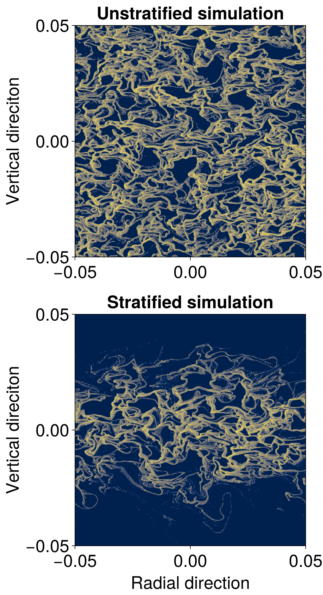

_Dubrovnik, Croatia_

I am a Nevada Center for Astrophysics Postdoctoral Fellow at the University of Nevada, Las Vegas. My research is in theoretical and computational planet formation: I use high-resolution numerical simulations to study the dynamics of dust and gas in protoplanetary disks, and the conditions under which the streaming instability concentrates solids strongly enough to form planetesimals.

I completed my Ph.D. in astrophysics at Iowa State University in 2026, advised by Prof. Jacob B. Simon. Before that, I earned my B.S. and M.S. in astronomy at Chungnam National University in Daejeon, South Korea, where I grew up.

# Research

## Conditions for Planetesimal Formation by the Streaming Instability in Protoplanetary Disks

     
My primary research focuses on planetesimal formation within protoplanetary disks. Planetesimals, roughly 1 to 100 km in size, are the fundamental building blocks of planets. They are thought to form through the gravitational collapse of millimeter- to centimeter-sized dust grains.

Among several proposed mechanisms, the streaming instability is a leading candidate because it can efficiently concentrate dust to the point of grabitational collapse (often termed strong clumping). In this project series, I investigate the physical conditions under which the streaming instability can form planetesimals, focusing on the role of grain size, dust abundance, and turbulence strength. Using 3D simulations, I examined both [laminar](https://ui.adsabs.harvard.edu/abs/2025arXiv250918270L/abstract) and [turbulent](https://ui.adsabs.harvard.edu/abs/2024ApJ...969..130L/abstract) disk environments, establishing planetesimal formation criteria across a wide range of protoplanetary disk conditions.

The plot on the right shows the planetesimal formation conditions for both laminar (black dots) and turbulent (solid lines) cases from my 3D simulations. Above the lines, the streaming instability can efficiently concentrate solids and produce planetesimals.

## Dust-gas Dynamics Driven by the Streaming Instabiltiy 

The streaming instability (SI) is an important mechanism not only for planetesimal formation, but also for driving the coupled dynamics of dust and gas near the disk midplane. In this work, I investigate the characteristics of SI-driven dynamics in vertically stratified protoplanetary disks and systematically compare them with unstratified simulations (i.e., without stellar vertical gravity) across a range of radial pressure gradients.

[This research](https://ui.adsabs.harvard.edu/abs/2025ApJ...993...12L/abstract) provides a comprehensive view of streaming instability behavior and demonstrates that, within the parameter space explored, the instability behaves fundamentally the same in unstratified disks and in the midplane region of stratified disks. 

The figure shows the dust density field from unstratified (top) and stratified (bottom) simulations, illustrating the similarity in the resulting structure. Both cases exhibit comparable filamentary morphology, with the stratified simulations showing more vertical confinement due to stellar gravity.
